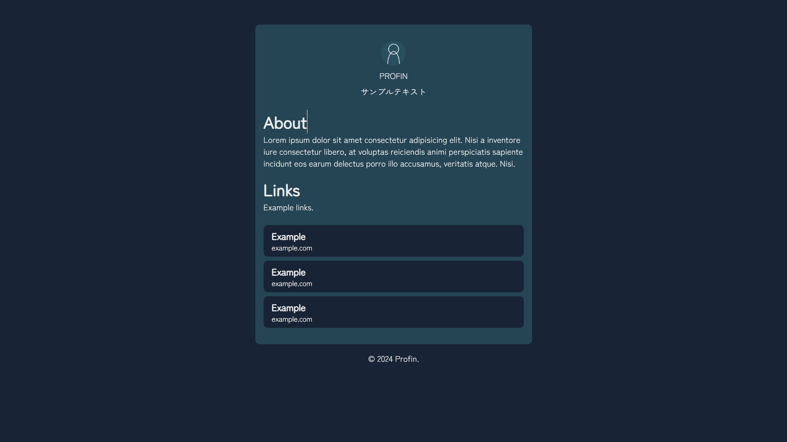

# Profin


Profinは、小さなプロフィールページのテンプレートです。

## 使い方

### プロフィール
```html
<div class="profile">
    
    <span>名前(省略可)</span>
    <span>一言(省略可)</span>
</div>
```

### テキスト
```html
<div class="write">
    <h1>タイトル(省略可)</h1>
    <p>文章(省略可)</p>
</div>
```

### リンク
```html
<div class="links">
    <a href="https://example.com/">
        <span>タイトル</span>
        <p>説明</p>
    </a>

    <a href="https://example.com/">
        <span>Example</span>
        <p>example.com</p>
    </a>
</div>
```

## 変更履歴

### v1.0.0 / 2024-01-16
- 公開